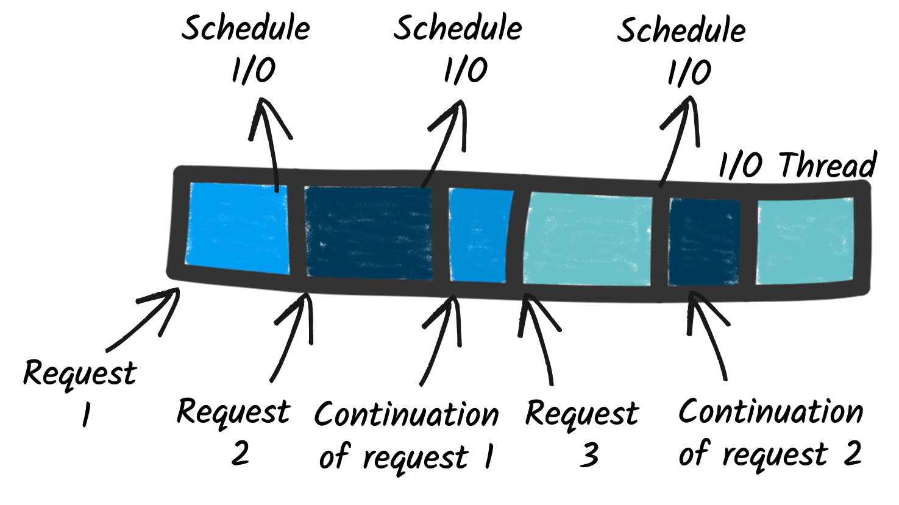

# Quarkus gRPC Service Setup

Create solutions with Quarkus Project Generator 

```Bash
https://code.quarkus.io
```

Or

```Bash
quarkus create app org.acme:quarkus-grpc --extension='grpc'
```

If selecting the grpc project, jump to the testing section below.

Let’s start an application now where we can incrementally add the capabilities to create an gRPC application in Quarkus and gain the understanding of what just happened.

```Bash
quarkus create app org.acme:quarkus-grpc-demo --extension='resteasy'
```

Configure the maven file with the grpc dependency

```Java
<dependency>
    <groupId>io.quarkus</groupId>
    <artifactId>quarkus-grpc</artifactId>
</dependency>
```

Add the reactive rest dependency as we are using a reactive programming model

```Java
<dependency>
    <groupId>io.quarkus</groupId>
    <artifactId>quarkus-resteasy-reactive</artifactId>
</dependency>
```

If we are using any of the common grpc proto types, let’s add the dependency

```Java
        <dependency>
            <groupId>com.google.api.grpc</groupId>
            <artifactId>proto-google-common-protos</artifactId>
        </dependency>
        <dependency>
            <groupId>com.google.protobuf</groupId>
            <artifactId>protobuf-java</artifactId>
        </dependency>
```

Add the property so quarkus checks for the common dependencies

```Java
# In application.properties
quarkus.generate-code.grpc.scan-for-imports=all
quarkus.grpc.clients.hello.host=localhost
```

Make sure we have the generate code goal and the generate code for tests goal.  
This will now allow quarkus to generate code from the proto files in *src/main/proto*.  
the retrieved protoc compiler will match the OS and CPU architecture we are building on.  
These are changeable with the *-Dquarkus.grpc.protos-os-classifier=&lt;os-classifier&gt;*.

```Java
<build>
    <plugins>
        <plugin>
            <groupId>io.quarkus</groupId>
            <artifactId>quarkus-maven-plugin</artifactId>
            <version>${quarkus-plugin.version}</version>
            <extensions>true</extensions>
            <executions>
                <execution>
                    <goals>
                        <goal>build</goal>
                        <goal>generate-code</goal>
                        <goal>generate-code-tests</goal>
                    </goals>
                </execution>
            </executions>
        </plugin>
    </plugins>
</build>
```

Let’s create a *HelloWorld* by creating a service in src/main/proto/helloworld.proto.

```Go
syntax = "proto3";

option java_multiple_files = true;
option java_package = "io.quarkus.example";
option java_outer_classname = "HelloWorldProto";

package helloworld;

// The greeting service definition.
service Greeter {
    // Sends a greeting
    rpc SayHello (HelloRequest) returns (HelloReply) {}
}

// The request message containing the user's name.
message HelloRequest {
    string name = 1;
}

// The response message containing the greetings
message HelloReply {
    string message = 1;
}
```

Let’s compile the code and inspect the /target/generated-sources/grpc.

```Bash
$ mvn compile
$ tree target/generated-sources/grpc
target/generated-sources/grpc
└── io
    └── quarkus
        └── example
            ├── Greeter.java
            ├── GreeterBean.java
            ├── GreeterClient.java
            ├── GreeterGrpc.java
            ├── HelloReply.java
            ├── HelloReplyOrBuilder.java
            ├── HelloRequest.java
            ├── HelloRequestOrBuilder.java
            ├── HelloWorldProto.java
            └── MutinyGreeterGrpc.java
```

Now we can implement the [service.](http://service.it)

Let’s create the service at /src/main/java/org/acme/HelloService.java.

```Java
package org.acme;

import io.quarkus.example.Greeter;
import io.quarkus.example.HelloReply;
import io.quarkus.example.HelloRequest;
import io.quarkus.grpc.GrpcService;
import io.smallrye.mutiny.Uni;

@GrpcService 
public class HelloService implements Greeter {  

    @Override
    public Uni<HelloReply> sayHello(HelloRequest request) { 
        return Uni.createFrom().item(() ->
                HelloReply.newBuilder().setMessage("Hello " + request.getName()).build()
        );
    }
}
```

What did we just do?

- Exposed the implementation as a bean
- Implemented the generated service interface
- Implemented the methods defined in the service definition

What is this uni and multi stuff?

In the traditional and imperative approach, frameworks assign a thread to handle the request. So, the whole processing of the request runs on this worker thread. This model does not scale very well. Indeed, to handle multiple concurrent requests, you need multiple threads; and so your application concurrency is constrained by the number of threads. In addition, these threads are blocked as soon as your code interacts with remote services. So, it leads to inefficient usage of the resources, as you may need more threads, and each thread, as they are mapped to OS threads, has a cost in terms of memory and CPU.


On the other side, the reactive model relies on non-blocking I/Os and a different execution model. Non-blocking I/O provides an efficient way to deal with concurrent I/O. A minimal amount of threads called I/O threads, can handle many concurrent I/O. With such a model, request processing is not delegated to a worker thread but uses these I/O threads [directly.It](http://directly.it/) saves memory and CPU as there is no need to create worker threads to handle the requests. It also improves the concurrency as it removes the constraint on the number of threads. Finally, it also improves response time as it reduces the number of thread switches.



gRPC server services are served by a server.  Ha.

Available services (CDI beans) are automatically registered and exposed.

So, with the reactive execution model, the requests are processed using I/O threads.
But that’s not all.
An I/O thread can handle multiple concurrent requests.
How? Here is the trick and one of the most significant differences between reactive and imperative.

When processing a request requires interacting with a remote service,  like an HTTP API or a database, it does not block the execution while waiting for the response.
Instead, it schedules the I/O operation and attaches a continuation, i.e., the request processing remaining code.
This continuation can be passed as a callback (a function invoked with the I/O outcome), or use more advanced constructs such as reactive programming or co-routines.
Regardless of how the continuation is expressed, the essential aspect is the release of the I/O thread and, as a consequence, the fact that this thread can be used to process another request.
When the scheduled I/O completes, the I/O thread executes the continuation, and the processing of the pending request continues.

So, unlike the imperative model, where I/O blocks the execution, reactive switches to a continuation-based design, where the I/O threads are released, and continuation invoked when the I/Os complete.
As a result, the I/O thread can handle multiple concurrent requests, improving the overall concurrency of the application.

But, there is a catch.
We need a way to write continuation-passing code.
There are many ways of doing this.
In Quarkus, we propose:

- Mutiny - an intuitive and event-driven reactive programming library

By default, the server is exposed on [localhost:9000](http://localhost:9000) and uses plain-text (no TLS) when running normally and [localhost:9001](http://localhost:9001) for tests.

We can run the application using:

```Bash
$ mvn quarkus:dev
```

